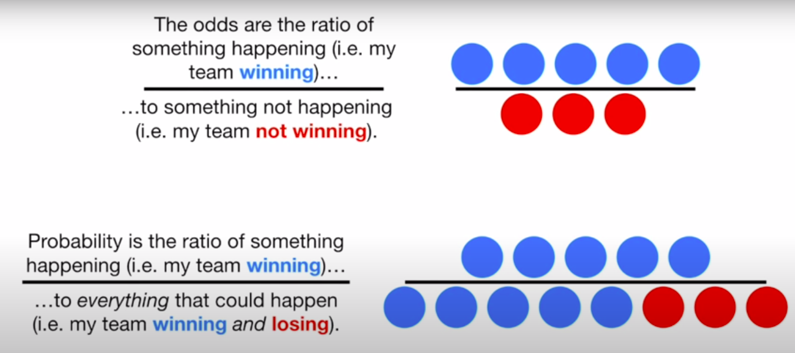
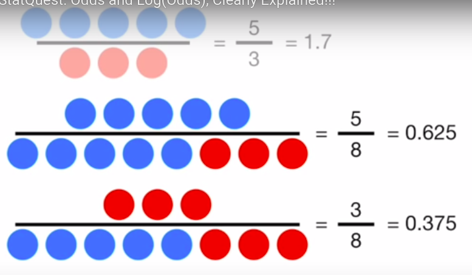

# Machine Learning


**Definitions**: 

- A machine learning algorithm is an algorithm that is able to learn from data. But what do we mean by learning? Mitchell (1997) provides a succinct definition: “A computer program is said to learn from experience E with respect to some class of tasks T and performance measure P, if its performance at tasks in T, as measured by P, improves with experience E.” <br> <br>
- Machine learning enables us to tackle tasks that are too difficult to solve with fixed programs written and designed by human beings.  For example, if we want a robot to be able to walk, then walking is the task. We could program the robot to learn to walk, or we could attempt to directly write a program that specifies how to walk manually. <br><br>
- Machine learning tasks are usually described in terms of how the machine learning system should process an example. An example is a collection off features that have been quantitatively measured from some object or event that we want the machine learning system to process.
  <br>*5.1 Learning Algorithms* https://www.deeplearningbook.org/contents/ml.html
  
---
## Stats

<details>
  <summary>Odds vs Probability</summary>
  
  
[Odds vs Probability](https://www.youtube.com/watch?v=ARfXDSkQf1Y)
<br>
Above odds, below probability.<br>

<br>
From probability to odds: <br>
0.625/0.375
<br>
</details>

---
<br>

## Tree Models & Ensembles 


**Definition:**


A decision tree is a flowchart-like structure in which each internal node represents a "test" on an attribute (e.g. whether a coin flip comes up heads or tails), each branch represents the outcome of the test, and each leaf node represents a class label (decision taken after computing all attributes). The paths from root to leaf represent classification rules.

> Think about it like train tracks. You go left or right and then again, arriving at a certain destination. The algorithm builds a metaphorical route mapping from station of departure to station of arrival. This is how you construct the sequence of tracks, new information then just runs on these tracks, (producing the predictions.) 

<br>
<br>
Decision trees can be used for classification or regression prediction.

The term Classification And Regression Tree (CART) analysis is an umbrella term used to refer to both of the above procedures, first introduced by Breiman et al. in 1984.

---

**Multiple Decision Trees:**

Ensemble methods use more than one algorithm for prediction. 

Types of ensemble methods: 
- Boosting: <br>
    Boosting constructs and adds weak models in a stage-wise fashion, one after the other, each one chosen to improve the overall model performance.
  <br><br>
- [Bagging](https://blog.mlreview.com/gradient-boosting-from-scratch-1e317ae4587d)
    - A random forest classifier is a specific type of bootstrap aggregating
---


<br>

## Fraud Detection 


<!-- <details> -->
  <summary>How to break down a predictive modelling solution</summary>
  

<https://www.youtube.com/watch?v=Mssq4KvSWZM&ab_channel=DataScienceJay>
<https://www.interviewquery.com/questions/decision-tree-evaluation>

<br>

Let’s say you work as a data scientist at a bank.

You are tasked with building a decision tree model to predict if a borrower will pay back a personal loan they are taking out.

How would you evaluate whether using a decision tree algorithm is the correct model for the problem?

Let’s say you move forward with the decision tree model. How would you evaluate the performance of the model before deployment and after?

1. Context:
    - Determine banks objective: Growth vs profitability 
        <br> (If 1 is pay backs loan and 0 is doesn't pay back loan.)
        - Growth: < 0.50% [decision threshold](Less confident of payback)        
        - Profitability: > 0.50% (decision threshold) [More confident of payback]

2. Target Metric
    - How accurate is the current verison of the decision tree? 
    - Baseline model 
    - Imbalanced dataset (Absolute accuracy is bad measure):
        - Precision - Recall AUC score 
        - F1 Score (Harmonic mean between Precision - Recall)
        - Accuracy: 
            1. i.e. 95% 
            2. 97% (+2% absolute or 2/95 +2.1% relative accuracy improvement)
            [This might be useful for explaining model accuracy to business. "We've achieved a x% improvement on the baseline model/pre existing model"]
                        
3. Solution 
    - Interpretability
    - Volume of historical data
    - Requirement in production 
    - Accuracy


</details>
<br>

**Resources:**
chrome://bookmarks/?id=1973


<br>
<br>
<br>
<br>
<br>
<br>
<br>
<br>
<br>

---
**to use**: <Br><Br>
lambda, map 

pandas.Series.map
<Br>
Map values of Series according to input correspondence.
```python
def converter(x):
    c, n = '', ''
    x = str(x).replace('.', '').replace('/', '').replace(' ', '')
    for i in x:
        if i.isnumeric():
            n += i
        else:
            c += i
    if n != '':
        return c, int(n)
    return c, np.nan


def create_extra_features(data):
    data['Ticket_type'] = data['Ticket'].map(lambda x: converter(x)[0])
```
<br>

- Maybe read a bit more on pruning for boosted trees
- How to train gbm models on gpu. Now that you have one 

