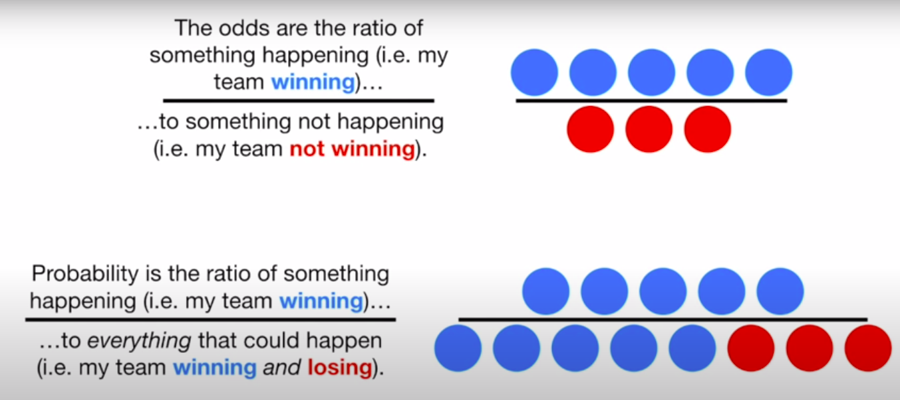
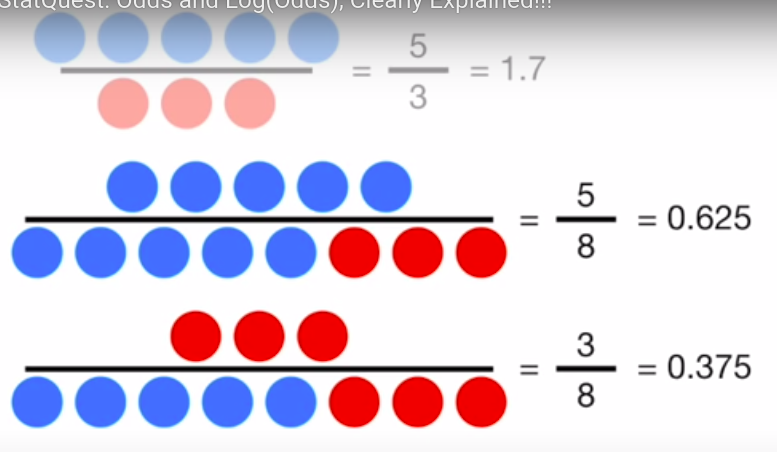

# Machine Learning

---

## Definitions: 

- A machine learning algorithm is an algorithm that is able to learn from data. But what do we mean by learning? Mitchell (1997) provides a succinct definition: “A computer program is said to learn from experience E with respect to some class of tasks T and performance measure P, if its performance at tasks in T, as measured by P, improves with experience E.”    
- Machine learning enables us to tackle tasks that are too difficult to solve with fixed programs written and designed by human beings.  For example, if we want a robot to be able to walk, then walking is the task. We could program the robot to learn to walk, or we could attempt to directly write a program that specifies how to walk manually.   
- Machine learning tasks are usually described in terms of how the machine learning system should process an example. An example is a collection off features that have been quantitatively measured from some object or event that we want the machine learning system to process.
   *5.1 Learning Algorithms* https://www.deeplearningbook.org/contents/ml.html
  

## Stats
### [Odds vs Probability](https://www.youtube.com/watch?v=ARfXDSkQf1Y)
 

Above odds, below probability. 

From probability to odds:  
0.625/0.375
 

### Gradient Boosting

