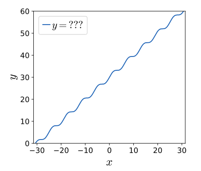
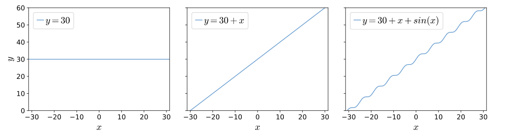
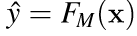
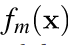

# Machine Learning

---

## Definitions: 

- A machine learning algorithm is an algorithm that is able to learn from data. But what do we mean by learning? Mitchell (1997) provides a succinct definition: “A computer program is said to learn from experience E with respect to some class of tasks T and performance measure P, if its performance at tasks in T, as measured by P, improves with experience E.”    
- Machine learning enables us to tackle tasks that are too difficult to solve with fixed programs written and designed by human beings.  For example, if we want a robot to be able to walk, then walking is the task. We could program the robot to learn to walk, or we could attempt to directly write a program that specifies how to walk manually.   
- Machine learning tasks are usually described in terms of how the machine learning system should process an example. An example is a collection off features that have been quantitatively measured from some object or event that we want the machine learning system to process.
   *5.1 Learning Algorithms* https://www.deeplearningbook.org/contents/ml.html
  

## Stats
### [Odds vs Probability](https://www.youtube.com/watch?v=ARfXDSkQf1Y)
 

Above odds, below probability. 

 
From probability to odds:  
0.625/0.375
 
---
### Gradient Boosting

Additive modelling is the foundation of boosting.  
Additive modelling basically means we start from simple functions and add more on top.  
Example: 
We want to find the function which best fits this set of y values. When y is 30 what is x. In this case we use a single feature but when modelling x is a vector of features.   
 
We start from the simplest of functions, 30, because that's the y-intercept. Then we fix the gradient of the slope. But then we're missing the squiggly bit which is remedied by introducing a sine function into the overall function. The idea is that that is how gradient boosting works, we start with 'weak learners' and then add more functions until adding more functions doesn't reduce the error anymore. But we'll get to that. 

**Summary**  
In the machine learning world, we're given a set of  data points rather than a continuous function, as we have here. The goal is to create a function that draws a nice curve through the data points. We call that function a model and it maps x to y, thus, making predictions given some unknown x. Adding up a bunch of subfunctions to create a composite function that models some data points is then called additive modeling. Gradient boosting machines use additive modeling to gradually nudge an approximate model towards a really good model, by adding simple submodels to a composite model.

### Definition
Boosting is a loosely-defined strategy that combines multiple simple models into a single composite model. The idea is that, as we introduce more simple models, the overall model becomes a stronger and stronger predictor. In boosting terminology, the simple models are called weak models or weak learners.

Boosting constructs and adds weak models in a stage-wise fashion, one after the other, each one chosen to improve the overall model performance. The boosting strategy is greedy in the sense that choosing a particular formula never alters previous functions.
We could choose to stop adding weak models when 's performance is good enough  or when   doesn't add anything. In practice, we choose the number of stages, M, as a hyper-parameter of the overall model. Allowing M to grow arbitrarily increases the risk of overfitting.

 
 
 
 
 
 
 
 
 
 
 
 
 
> Resources:
  - https://explained.ai/gradient-boosting/L2-loss.html

