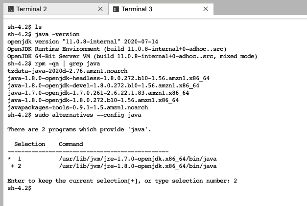
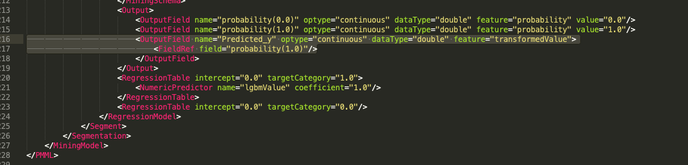

## Model2PMML
---

**Update**: please find the following files on S3 due to git limitations
* `cc_prospect_gen1_thick.parquet.gzip`: [link](s3://sofi-data-science/Risk_DS/rds_training/model2pmml/cc_prospect_gen1_thick.parquet.gzip)
* `thick_mono_list.csv`: [link](s3://sofi-data-science/Risk_DS/rds_training/model2pmml/thick_mono_list.csv)

you can download it using the `aws s3 cp <link> .` command.

---

We encounter the need to convert models from pickled files to PMML for Credit Karma Lightbox environment. This directory contains examples and common issues.

The code and examples are what made `CC prospect model v1` worked, which is expected to change for future iterations. Please update accordingly.

**Tools**
- run `./pmml_env.sh` to build a `to_pmml` python environment.
- libraries are listed in `requirements.txt` with working version contraints.
- see `email-chain-w-CK.pdf` for some common issues.
- if encounter error message: 
```
RuntimeError: The JPMML-SkLearn conversion application has failed. The Java executable should have printed more information about the failure into its standard output and/or standard error streams
```
The issue may be caused by inappropriate Java version. At the time of this implementation, we use PMML version 4.3, which requires Java v1.8+. We ran into the issue because the SageMaker instance applies Java v1.7 in default, but in fact it has v1.8 installed. So all we had to do is to activate that version. Solution can be found in 

Four Steps in command line:
- `java -version` to check java verison used
- `rpm -qa | grep java` shows which versions are installed
- `sudo alternatives --config java` shows which java we may choose from, and select the correct one you need. In our case, type `2`.
    - Note: start with `sudo` to enforce super-user permission.


**Five steps to convert model to PMML** (details refer to `sample-code-cc-prospect-gen1-thick` folder):
- read development data
- define data transformation using mapper
```
mapper,_ = make_lightgbm_dataframe_mapper(df_X.dtypes, missing_value_aware = True)
mapper=DataFrameMapper([(['REV5620'],ContinuousDomain( high_value=999999990,low_value=0,outlier_treatment='as_missing_values' )),
                        (['TBCA2527'],ContinuousDomain( high_value=999999990,low_value=0,outlier_treatment='as_missing_values' )),
                        (['BCC5620'],ContinuousDomain( high_value=999999990,low_value=0,outlier_treatment='as_missing_values' ))])
```
- fit model use LGBMClassifier
```
classifier = LGBMClassifier(objective = "binary",min_child_samples =300,boosting_type='gbdt',reg_lambda=5,
                            random_state=157,learning_rate=0.02,monotone_constraints=mono_list_constr,
                            max_depth=6, n_estimators = 1579,num_leaves=25,feature_fraction=0.8)

pipeline = PMMLPipeline([
  ("mapper",mapper),
  ("classifier", classifier)],
    predict_proba_transformer = Alias(ExpressionTransformer("X[1]"), name="Predicted_y", prefit=True))
    
pipeline.fit(df_X, df_y)
```
- `sklearn2pmml(pipeline, "cc_prospect_gen1_thick_pmml_test.xml",with_repr=True, debug=True)`  saves model to pmml
- manually delete highlight parts (at bottom of the document) in xml file 

Cheers!

