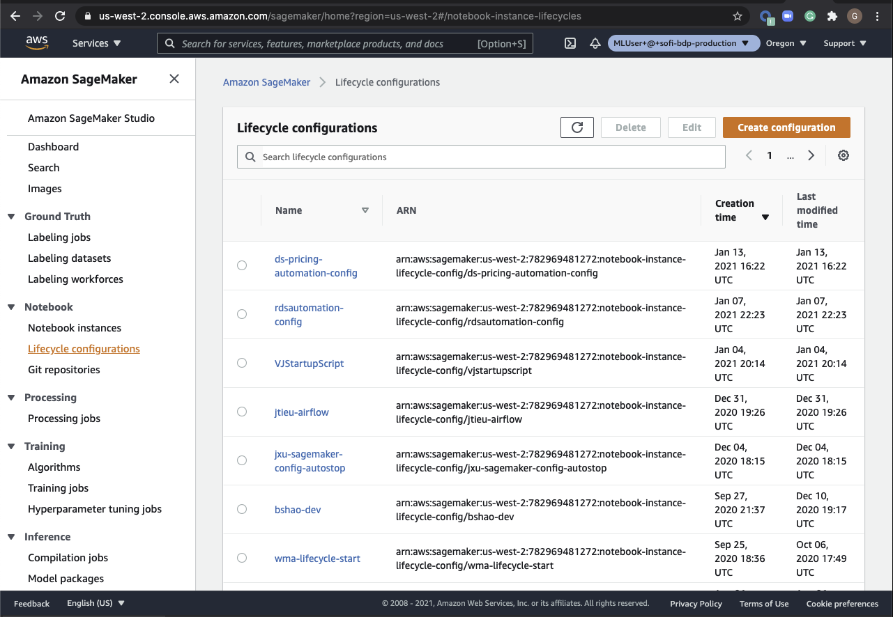
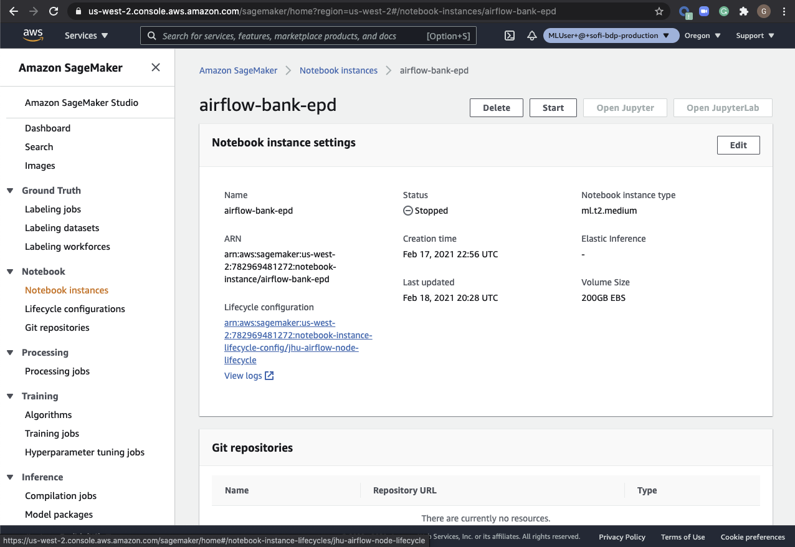

## SageMaker Lifecycle Config Tutorial
---

We use the `lifecycle configuration` to set up and customize our SageMaker Notebook instances. It is essentially a shell script that runs when the notebook instance starts. Think of it as a morning routine for the machine.

Official Documentation: [link](https://docs.aws.amazon.com/sagemaker/latest/dg/notebook-lifecycle-config.html)

### How-TO
---

* Before starting instances
    * Navigate to the AWS SageMaker home page. (Note: Do not forget to change the role to `MLUser@sofi-bdp-production`)
    * Find the tab `Lifecycle configurations` option under the `Notebook` tab on the left menu.
    
    * This is where current SoFi Lifecycle configurations live. You can create your own lifecyle config using existing ones as templates. Of course you can simply use someone else's config, but weird things may happen if they make any changes that you do not know of. 
    * We have included some examples in this folder. Please feel free to borrow any of those. 
* How to use the config
    * after creating/updating your lifecycle config, please go to the `Notebook Instances` list and find the target instance. Click on the instance name and enter the `Notebook instance settings` page. Hit the `Edit option`.
    
    * choose your `Lifecycle configuration` from the drop down menu under `Notebook instance settings -> Additional configuration`.
* Start your instance

### Important Note
--- 
The configration times out in 5 minutes, meaning if your lifecycle config does not finish in that period, you will see the instance start `Failure`. 

* Solutions 1 - recommended for initial setup: 
    * use a minimal setup like `sofi-notebook-start.sh` or `bshao-dev.sh` to get minimal setup.
    * then follow the best practice in [project-setup](https://gitlab.com/sofiinc/data-science-risk/mlops/project-sample) by create customized enviornment for all of your projects individually.
* Solution 2 - as a reference for customized solution: follow the instructions in `rds-team-config` directory

How to debug if something goes wrong?
* Look at the CloudWatch `logs` for your instance. 

### Templates
---

At SoFi we use `bash` script to initialize instances. Definitely worth it to have some basic understanding of it. 

We include 5 templates that differs in important ways. All should be plug and run except for `jxu-startup-script`. Details listed below:

##### Typical Options
1. `sofi-notebook-start.sh`: the default config by SoFi. The Minimum Viable Product of all lifecycle configs. Good place to start.
2. `bshao-dev.sh`: everything from 1 but comes with additional examples on installing python libraries to the `python3` kernel/environment.
3. `rds-team-config`: in addition to 2, added git setup and jupyter-lab customizations.

##### Complicated/Special Purpose ones
4. `jxu-startup-scripts`: a version that is inherited and in someways overly-complicated...maybe just use this as a reference. 
5. `rds_automation_lifecycle.sh`: the lifecycle config for team Airflow instance that is currently in development. We left it here as a reference. 

### Other practices we didn't use
---

#### Adding Custom Startup Scripts

Anything placed in the persistent location of /home/ec2-user/SageMaker/init.d/ folder on a SageMaker notebook using the sofi-notebook-start lifecycle configuration will be processed in alphabetical order by the lifecycle config startup script.  Anything ending in .sh that is executable will be executed and all other .sh files will be sourced. [reference](https://sofiinc.atlassian.net/wiki/spaces/DSML/pages/573149922/SageMaker+Notebooks)