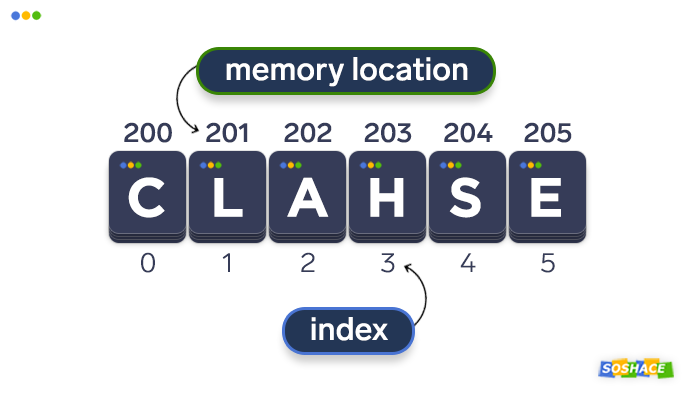
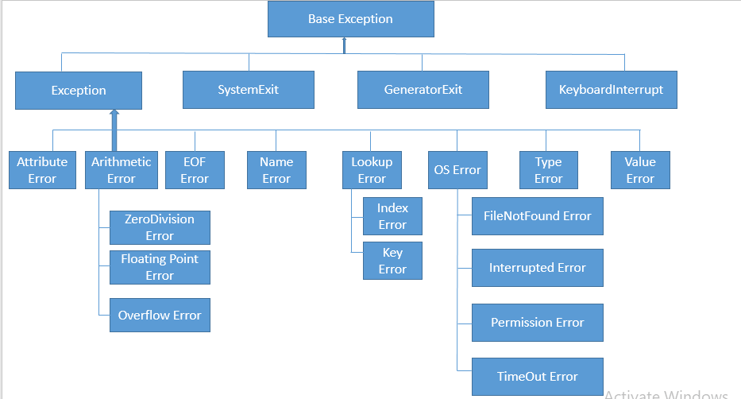

# Procedural-Programming with Python


* [Introduction](#Introduction)
  - [What is procedural programming](#What-is-procedural-programming)
  - [The Pythonic way of writing code](#The-Pythonic-way-of-writing-code)

* [Data Type](#Data-Type)
  - [What is a data type](#What-is-a-data-type)
  - [Primitive Types](#Primitive-Types)
  - [Sequence Types](#Sequence-Types)
  - [Other Collection Types](#Other-Collection-Types)

* [Identifier and Variable](#Identifier-and-Variable)
  - [Identifier](#Identifier)
  - [Variable](#Variable)
  - [Namespace and Scope](#Namespace-and-Scope)

* [Control Struture](#Control-Struture)
  - [Conditionals](#Conditionals)
  - [Loops](#Loops)

* [Function](#Function)
  - [What is a function](#What-is-a-function)
  - [Function interface](#Function-interface)
  - [Information passing](#Information-passing)
  - [Coding patterns and best practice](#Coding-patterns-and-best-practice)

* [Exception Handling](#Exception-Handling)
  - [What is an exception](#What-is-an-exception)
  - [Exception types](#Exception-types)
  - [Raising an exception](#Raising-an-exception)
  - [Catching an exception](#Catching-an-exception)
  - [How to handle an exception](#How-to-handle-an-exception)

* [Files Input and Output](#Files-Input-and-Output)

* [Advanced Topics](#Advanced-Topics)
  - [Comprehension Syntax](#Comprehension-Syntax)
  - [Functional Features](#Functional-Features)  
  - [Object-oriented Features](#Object--oriented-Features)
  - ...


## Introduction

### What is procedural programming

- PP is a programming paradigm that is based on procedure calls. 
- Procedures are nothing but a list of instructions to be executed.
- It focuses on the process rather than object (_object-oriented_ programming) and function (_functional_ programming), or on describing what should be computed (_declarative_ programming).

### The Pythonic way of writting code

- There are many ways to accomplish the same task in Python, but there is usually one preferred way to do it. This preferred way is called "_pythonic_".
- It is the best way to use Python and builds on the fundamental understanding of the language.
- You should focus on learning the best practices of Python's capabilities and features.
- Refernces:
  - Brett Slatkin, Effective Python
  - Kenneth Reitz and Tanya Schlusser, The Hitchhiker’s Guide to Python
 
## Data Type

### What is a data type

- A _data type_ is a classification of data that specifies its possible values and the operations that can be performed on it.
- It can be built-in types or userdefined types.

>_Note_:
> Data type is a concept specific to a programming language while data structure is a general computer science concept for organizing data and operations. 
> In a way, data type is a concrete implementation of a data structure in a particular programming language. However, in Python everyting is an object.

### Primitive Types

* _Primitive Types_ are Python built-in "single value" (also referred as _scalar_) types.

* logical: bool
  - by default, bool() returns False
  - every object has a boolean value. The following elements are false:
    - None
    - 0 (for numeric type)
    - empty collections: “”, (), [], {}
    - objects from classes that have the special method __nonzero__
    - objects from classes that implements __len__ to return False or zero
    - all other objects are True.


>_Note_:
> An important application is the use of bool(s) as a condition in a control structure.

  Example:

  ```python
  >>> class A():
  >>>   def __len__(self):
  >>>     return 0
  >>> 
  >>> class B():
  >>>   def __nonzero__(self):
  >>>     return 0
  >>>
  >>> a = A()
  >>> bool(a)
  False
  >>> b = B()
  >>> bool(b)
  False
  >>> class C():
  >>>   pass
  >>>
  >>> c = C()
  >>> bool(c)
  True
  >>> if c: print('True')
  True
  ```  

* numeric: int, float
  - by default, int() or float() returns zero (0 or 0.0).
  - when given a parameter x, both int(x) or float(x) will attempt to return the equivalent numeric value.


>_Note_: These primitive types are immutable.


### Sequence Types

* What is a sequence 
  - A sequence is a colection of objects whose ordering matters
  - Internally, Python represents it as an _array_ (a low-level concept) which is a group of related variables can be stored at contiguous memory. 

  Example:
  
  A string is stored as an ordered sequence of Unicode charaters.

  <p align="center">
  
  </p>

  - Python offers the uniform handling of sequences with a rich set of common operations including 
    - iterating through a sequence
      - using a loop for automatical iteration 
      - using iter()/next() for manual iteration
    - accsessing its element using seq[j].
    - slicing using seq[start:stop:step]
      - reversing using seq[::-1] or list(reversed(seq))
    - sorting using seq.sort() or soted(seq)
    - concatenation using seq1 + seq2 

* Built-in sequence types
  - container: list and tuple can hold items of different types 
  - flat: str, bytes can only hold items of one type

* _list_ 
  - the list() constructor produces an empty list by default and accepts any parameter that is of an iterator type.
  - list() always creates a new list (i.e. a copy).

  Example:

  ```python
  >>> a = [1,2,3]
  >>> a = b
  >>> a is b
  True
  >>> c = list(a)
  >>> a is c
  False
  ```

  - has a variable length and can dynamically extend and contract 
    - adding a single element e at the end of the list: a_list.append(e)
    - adding elementss of an iterable at the end of the list: a_list.extend(iterable)
    - insert an element e at the index j in the list: a_list.insert(j,e)


>_Note_: insert is an expansive operation for list

    - removing the element e at the index j from the list and returns the removed item: a_list.pop(j)
    - removing the first such element from the list and returns the removed item: a_list.pop(e)
    - sorting the list using the sort() method or the sorted() fuction

    >_Note_ the difference between sort() and sorted(): sort() changes the list directly and doesn't return any value, while sorted() doesn't change the list but returns the sorted list.

    - concatenation using (+) : list1 + list2 returns a new list


>_Note_:    
> Concatenation using (+) for list is an expansive operation, using the extend method to append elements to an existing list.


  - usage in data processing:
    - to materilize an iterator or generator expression: e.g. list(iter) or list(gen)


* _tuple_ 
  - as an immutable version of list
    - supports all list methods that do not involve adding or removing elements
  - as records with no field names
    - the collections.namedtuple function produces a subclass of tuple enhanced with a class name, field names and a few new attributes/methods.  

    Example:

    ```python
    >>> from collections import namedtuple
    >>> Loan = namedtuple('Loan', 'borrower_id product amount term'])
    >>> pl = Loan(1234, 'PL', 50,000, 5)
    >>> pl
    ```

  - _tuple unpacking_ used for _parallel assignment_ and _varible swapping_

    Example: swapping the values of variables without using a temporary variable

    ```python
    >>> b, a = a, b
    >>> # the traditional way
    >>> tmp = a
    >>> a = b
    >>> b = tmp
    ```

    Example: return multiple values from a function

    ```python
    >>> import sklearn.model_selection as model_selection
    >>> X_train, X_test, y_train, y_test = model_selection.train_test_split(X, y)
    ``` 

    >_Note_:
    > There is one important subtlety - one element tuple: (element,).


* str and bytes
  - both represent an immutable sequence of characters.
  - difference: str contains Unicode charaters while bytes contain raw 8-bit values
  - conversions: 
    - from str to bytes using the encode('utf-8') method
    - from bytes to str using the decode('utf-8') method 
  - Pythonic: two useful helper functions:

  ```python
  >>> def bytes_to_str(s): 
  >>>   if isinstance(s, bytes):
  >>>     value = s.decode('utf-8')
  >>>   else
  >>>     value = s
  >>>   return value
  ```

  ```python
  >>> def str_to_bytes(s): 
  >>>   if isinstance(s, str):
  >>>     value = s.encode('utf-8')
  >>>   else
  >>>     value = s
  >>>   return value
  ```

### Other Collection Types

* mapping: dict

  - What is a dict (also known as hash map or associative array)
    - represents a mapping from a set of distinct keys to associated values.
    - has an optimized method (using hash table) for finding the value of an object.
    - the dict() constructor produces an empty set, as well as {}.
    - dict() accepts a existing dict or a list of 2-tuples as a parameter.
    - valid keys (hashability) have to be immutable objects (check it using hash(obj))


>_Note_:
> For tuples, all the objects in the tuple need to be immutable as well.

  - Common operations
    - access, insert, or set elements using the same syntax as for sequence types
    - check if a dict contains the key: if key in dict
    - delete value using the del keyword or the pop method
    - the keys and values methods return iterators of the dict's keys and values
    - merge one dict into another (in-place) using the update method

  - Default values
    - get vs. pop methods: get returns None by default if the key is not present while pop will raise an exception
    - the setdefault method
    - the collections.defaultdict class

* set

  - What is a set
    - represents a collection of unordered, unique, and immutable objects of arbitrary types.
    - set itself may be modified, _frozenset_ is an immutable form of set.
    - the set() constructor produces an empty set, but not {}.
    - we can think it as a key-only dict without values

  - Common operations
    - mathematical set operations


## Identifier and Variable

### Identifier

- a user-defined name given to entities in a program like variables, functions, class, etc. It helps to differentiate one entity from another.
- implicitly associated with the memory address of the object to which it refers.


### Variable

* Variable is a special kind of identifier given by the assignment statement.
  - Syntax: variable = < an entity >
  - when a variable is assigned, you are create a reference that points to the _memory address_ of that object.
  - if the entify is a value, then it references an object having that value.
  - if the entify is also an identifier, then it is an alias to the same existing object (not a copy).


>_Note_: 
>- using the id() function to find out the memory address of an object and 
>- using the _is_ keyword to check if two variables refer to the same object (meaning they point to the same memory address).


  Example: 

  x = 5:  x --> an int object with value 5 
  y = x:  y --> an alias of x


>_Note_:
>- Assignment statements do not copy objects, they are _binding_ a name (x) to an object.
>- In Python, variable don't need to declared and don't have a fixed type.

* A constant is a type of variable whose value cannot be changed and usually declared and assigned in a module.

  Example:

  In a constant.py:

  ```python
  >>> DEFAULT_VALUE = 999
  >>> MISSING_VALUE = -1
  ```
  
  In the main.py:

  ```python
  >>> import constant
  >>> print(constant.DEFAULT_VALUE)
  ```


### Namespace and Scope

* The problem

- Writing a program will invole the creation of many identifiers, each pointing to a specific object.
- How does Python keep track of all these names so that they don’t interfere with one another?

* Namespaces

- The concept
  - namespace is a structure used to organize the names assigned to objects in a Python program.
  - like modules, it provide a natural way to ensure the separation of abstraction layers.

- How Python organizes names and objects in namespaces

  - In Python, there are three types of namespaces, each with a different lifetime:

    - Built-in 
      - contains the names of all of Python’s built-in objects.
      - These are available at all times when Python is running. 

    - Global
      - contains all names defined at the level of the main() program.
      - can be created when your program import any module or the main() program body starts, and it remains in existence until the program exits.


    - Local
      - is local to an object such a function or an instance of a class
      - for a nested object, the innermost namespace is called the enclosing namespace while the outermost namespace is called the enclosed namespace.
    

- How namespaces are implemented
  - Python implements both global and local namespaces as dictionaries in which the keys are the object names and the values are the objects themselves.


>_Note_: The built-in namespace doesn’t behave like a dictionary. Python implements it as a module.


  - Namespace accessing tools
    - dir(__builtins__) returns a list of objects in the built-in namespace
    - globals() returns an actual _reference_ to the dictionary that contains the global namespace.
    - locals() returns a dictionary that is a current _copy_ of the local namespace, not a reference to it.

- Scope
  - The concept
    - The scope of a name is the region of a program in which that name has meaning or visibility.
    - Python determines this at runtime based on where the name definition occurs and where in the code the name is referenced.

  - To determine the scope of a variable x, Python follows the LEGB rule: 
    - Local: first in the innermost local namespace, then in the outermost local namespace
    - Global: If not found in the above searches, then look in the global scope namespace.
    - Built-in: If it can’t find x anywhere else, then try the built-in namespace.
    If Python doesn’t find the name in any of these namespaces, then a _NameError_ will be raised.
 
    Example:

    ```python
    >>> x = 'global'
    >>> def f():
    >>>   x = 'enclosing'
    >>>   def g():
    >>>     x = 'local'
    >>>     print(x)
    >>>   g()
    >>> f()
    local
    ```

    ```python
    >>> x = 'global'
    >>> def f():
    >>>   x = 'enclosing'
    >>>   def g():
    >>>     print(x)
    >>>   g()
    >>> f()
    enclosing
    ```

    ```python
    >>> x = 'global'
    >>> def f():
    >>>   def g():
    >>>     print(x)
    >>>   g()
    >>> f()
    global
    ```

## Control Struture

### Conditionals

* execute a lock of code based the real-time evaluation of a Boolean expression
  - if, elif, and else
  - ternary expression: value = true-expr if condition else false-expr
  - nonboolean tyes may also used as a condition


### Loops 

* for loop
  - provides an iteration through a series of values
  - syntax: for _element_ in _iterable_

  Example: 

  ```python
  >>> max_value = data[0] 
  >>> for val in data:
        if val > max_value:
          max_value = val
  >>> print(max_value)
  ```

  ```python
  >>> max_index = 0
  >>> for j in range(len(data)):
        if data[j] > data[max_index]:
          max_index = j
  >>> max_value = data[max_index]
  ```

* while loop
  - allows repetation based upon a repeated testing of a Boolean expression


## Function

### What is a function

* Function is a named block of code defined using the _def_ keyword.
  - syntax:

    ```python
    >>> def <function_name>([<parameters>]):
    >>>   <statement(s)>
    ```

  >_Note_:  
  > When a function is called, Python creates a activation record that stores information relevant to the call. 


* Why using functions
  - Abstraction and reusability
    - The abstraction of functionality into a function definition is an example of the _Don’t Repeat Yourself (DRY) Principle_ of model development. 
  - Modularity
    - Functions allow complex processes to be broken up into smaller steps.

    Example: 
    A data preparation program that reads in a file, processes the file, and then output the result. 

    ```python
    >>> # Main program
    >>> 
    >>> # Code to read a file in
    >>> <statement>
    >>> <statement>
    >>> <statement>
    >>> ...
    >>> 
    >>> # Code to process the file
    >>> <statement>
    >>> <statement>
    >>> <statement>
    >>> ...
    >>> 
    >>> # Code to output the result
    >>> <statement>
    >>> <statement>
    >>> <statement>
    >>> ...
    >>> 
    ```

    ```python
    >>> def read_file():
    >>>   # Code to read a file in
    >>>   <statement>
    >>>   <statement>
    >>>   <statement>
    >>>   ...
    >>> 
    >>> def process_file():
    >>>   # Code to process the file
    >>>   <statement>
    >>>   <statement>
    >>>   <statement>
    >>>   ...
    >>> 
    >>> def output_file():
    >>>   # Code to output the result
    >>>   <statement>
    >>>   <statement>
    >>>   <statement>
    >>>   ...
    >>> 
    >>> # Main program
    >>> def main():
    >>>   read_file()
    >>>   process_file()
    >>>   output_file()
    ```

### Function interface

* Function syntax:

  ```python
  >>> def function_name(parameters):
  >>>   """docstring"""
  >>>   statement(s)
  ```

  >_Note_: A function returns a None if no return statement exists.

* Parameters vs. Arguments
  - Parameters (also known as _formal_ parameters) are variables specified in the function signature.
  - Arguments (also known as _actual_ parameters) are objects or values sent by the caller to the function when it is called.

  Example:

  ```python
  >>> # data and factors are parameters
  >>> def adjust(data, factor):
  >>>  for j in range(len(data)):
  >>>     data[j] *= factor
  >>> a_list = [1,2,3,4,5]
  >>> # a_list and the literal 2 are arguments
  >>> adjust(a_list, 2)
  ```
  - There are two types of parameters
    - positional parameters: order matters and must come before any keyword parameter
    - keyword parameters: key-value pairs and order does not matters


    >_Note_: the keyword parameters must follow the positional parameters (if any).


### Information passing

* _pass-by-assignment_

  - Passing argument follows the same semantic of the assignment statement.
    - Parameters are assigned by the arguments when a function is called. 
    - Return value is assigned to the caller.

* Passing immutable objects
  - A function can’t modify an immutable object outside its local scope

    Example:
   
    ```python 
    >>> def increment(n): # n -> int is immutable
    >>>   # n is local to the function
    >>>   n += 1
    >>> a = 3 # a is global to the function
    >>> increment(a)
    >>> print(a)
    a = 3   # a is still referring to the same int object with the value of 3
    ```

    the solution: “modify” immutable objects by capturing the return of the function.

    ```python 
    >>> def increment(n): # n -> int is immutable
    >>>   # n is local to the function
    >>>   n += 1
    >>>   return n
    >>> a = 3 # a is referring to an int object with value 3
    >>> a = increment(a)
    >>> print(a)
    a = 4   # a is still referring to a new int object with value 4
    ```

* Passing mutable objects 
  - A function can’t reassign the object, but it can change items in place within the object, and these changes will be reflected in the calling environment.

    Example:

    ```python
    >>> def append(seq):
    >>>   seq.append(4)
    >>> l = [1, 2, 3]  
    >>> append(l)  
    >>> print(l)
    l = [1, 2, 3, 4] # changed
    ```

    - Be careful when passing a mutable value as a default argument in a function, _the default argument is mutated anytime that value is mutated_.

    Example:

    ```python
    >>> def append(element, seq=[]):
    >>>   seq.append(element)
    >>>   return seq
    >>> append(1)  # seq is assigned to []
    [1]
    >>> append(2)  # seq is now given [1] as a default
    [1, 2]
    ```
    the solution is _Use None as a default and assign the mutable value inside the function_.

    ```python
    >>> def append(element, seq=[]):
    >>>   if seq is None:
    >>>     seq = []
    >>>   seq.append(element)
    >>>   return seq
    >>> append(1)  # seq is assigned to []
    [1]
    >>> append(2)  # seq is assigned to [] again
    [2]
    ```
     
* Modify variables out of scope

  - Using the _global_ declaration if you want modify a variable in the global scope from within the function.

  Example:

  ```python 
  >>> x = 5 
  >>> def f():
  >>>   global x
  >>>   x = 10 
  >>>   print(x)
  >>> f()
  10
  >>> x
  10
  ```

  ```python
  >>> import joblib
  >>> _model = None
  >>> def load_model():
  >>>   global _model
  >>>   # the model loaded only once
  >>>   if _model is None:
  >>>      _model = joblib.load("../model/ml-model.pkl")
  >>>   return _model
  >>>
  >>> def predict(row):
  >>>   model = load_model()
  >>>   # additional processing
  ```

   - Using the _nonlocal_ declaration if you want modify an object in the enclosing scope from within an enclosed function.

    Example:
   
    ```python 
    >>> def f():
    >>>   x = 5
    >>>   def g():
    >>>     nonlocal x
    >>>     x = 10
    >>>   g()
    >>>   print(x)
    >>> f()
    10
    ```


### Coding Patterns and Best Practice

* Writting functions that can accept any kind of sequence using the _isinstance_ function.

  Example:

  ```python
  >>> def any_sequence(x):
  >>>   if x isinstance(x,list):
  >>>     # list processing
  >>>   elif x isinstance(x,tuple):
  >>>     # tuple processing
  >>>   elif x isinstance(x,ndarray):
  >>>     # numpy processing
  >>>   else:
  >>>     # other processing
  ```
* Writting functions without side-effects, usually with function return values

  - A function is said to cause a side effect if it modifies its calling environment in any way.
    - When a function modifies data outside the local scope, either with the global or nonlocal keyword or by directly modifying a mutable type in place, these are examples of side effect.
    - Functions with side effects especially when it is unintended could lead to a lot of potential bugs which are harder to debug.
    - Care must be taken in writing function definitions containing mutable data types (like Lists, Sets, Dictionary etc…) as their function parameter.

* Writting functions with variable parameters
  - the *args idiom: take any (zero or more) positional parameters

    Example:

    ```python
    >>> paths = ('/usr/home/file1.csv', '/usr/home/file2.csv')
    >>> def read_files(*paths, format):
    >>>   dataset = 
    >>>   for file in paths:
            with open(file) as f:
              dataset += f.read()
          return dataset
    ```

  - the **kwargs idiom: take any (zero or more) keyword parameters

    Example:

    ```python
    >>> config = {"user": wma, "email": wma10016@gmail.com}
    >>> def set_config_defaults (config, **kwargs):
    >>>   for key, value in kwargs.items():
    >>>     # Do not overwrite existing value.
    >>>     if key not in config:
    >>>       config = value
    >>>   return config
    ```

    ```python
    >>> def general_function(*args, **kwargs):
    >>>   '''This is the most general way to define a function in Python'''
    >>>   for arg in args:
    >>>     print(arg)
    >>>   for key, value in kwargs.items():
    >>>     print("{} -> {}".format(key, value))
    ```

  >_Note_: within the function, args is a tuple while kdargs is a dictionary.

  - forced keyword arguments

    ```python
    >>> def forced_kwargs(*, x, y):
    >>>   # statements
    >>>   print(x,y)
    >>> forced_kwargs(x=, y=)
    ```
 

* some useful sequence functions

  - enumerate(seq): iterate over seq and returns a seq of (index, value) tuples

    ```python
    >>> result = {}
    >>> for i, v in enumerate(seq):
    >>>   # do something with value
    >>>   result[i] = v
    ```

  - zip(seq1, seq2, ...): "pairs" up the elements of a number of sequences and returns a list of tuples. The number of elements it produces is determined by the _shortest_ sequence. 

    ```python
    >>> # A common use of zip is simulaneously iterating over multiple sequences
    >>> # often commbined with enumerate 
    >>> for i, (v1, v2) in enumerate(zip(seq1, zip2):
    >>>   # do something with the values
    ```

    ```python
    >>> # For a given "zipped" sequence, zip can be used to unzip the sequence
    >>> # e.g. converting a list of rows into a list of columns
    >>> rows = [(1000, 650), (1001, 700), (1002, 800)] 
    >>> id, score = zip(*rows)
    ```
  
  >_Note_:
  > List and tuple are _referential structure_ that stores a sequence of references to objects (memory address) of arbitrary types while strings are seqences of characters. 


## Exception Handling

### What is exception

* An _exception_ is an unexpected event that occurs during the execution of a program.
  - When it occurs, the program will stop executing unless there is a block of code designed to handle this situation. 
  - It might result from a logical error or an unanticipated situation, so Python's error model is based on exceptions.

* Use of an exception
  - for error handling
  - for flow control

### Exception types

* In Python, exceptions are objects created by a rich hierarchy of exception classes that designate various categories of errors. The Exception class serves as a base class for most other error types.

  <p align="center">
  
  </p>

* Common causes of exceptions
  - Passing wrong parameters to a function including types, values, numbers and orders
  - Invalid index for seqence types such as IndexError for list, str, and tuple
  - Nonexisting elements such as KeyError for dictionaries
  - ...


### Raising an exception

- An exception can be raised by the _raise_ statement with an appropriate type.
- Python will raise an exception for most error types.
 - Your code can raise an exception for some exceptional behaviors.

Example:

```python
>>> # data validation
>>>
```

### Catching an exception

- A raised exception must be _caught_ (or _handled_) to prevent the stop of program execution.
- Syntax

  ```python
  >>> try:
  >>>   # perform normal processing
  >>>   do_something()
  >>> except <exception_type> as e:
  >>>   # handling exception
  >>>   error_handling(e)
  >>> finally:
  >>>   # optional, always run
  >>>   clean_up()
  ```

  >_Note_: There is a good rule of thumb - _put as little code as possible in the try block_.

  - test vs. try/except

  Example:

  ```python
  >>> # perform a proactive test if there are many tradelines with zero credit_limit
  >>> def utilization(balance, credit_limit):
  >>>   if credit_limit != 0:
  >>>      return balance / credit_limit
  >>>   else:
  >>>      return None
  ```

  ```python
  >>> # use a try/except structure if there are only a few tradelines with zero credit_limit
  >>> def utilization(balance, credit_limit):
   >>>   try:
  >>>      return balance / credit_limit
  >>>   except ZeroDivisionError:
  >>>      return None
  ```

  ```python
  >>> # within a function, prefer exceptions than return None
  >>> result = utilization(0, 5000)
  >>> if not result:
  >>>   print('Invalid credit_limit') # this is wrong!
  >>>
  >>> result = utilization(1000, 0)
  >>> if not result:
  >>>   print('Invalid credit_limit') # this is correct!
  >>> 
  >>> def utilization(balance, credit_limit):
  >>>   try:
  >>>      return balance / credit_limit
  >>>   except ZeroDivisionError as e:
  >>>      raise ValueError('Invalid credit_limit') from e
  >>> 
  >>> def check_result(balance, credit_limit):
  >>>   try:
  >>>     result = utilization(balance, credit_limit)
  >>>   except ValueError:
  >>>     print('Invalid credit_limit') 
  >>>   else:
  >>>     print('Utilization ratio is %.f' % result)
  >>> 
  >>> check_result(0, 5000)
  Utilization ratio is 0
  >>> check_result(1000, 0)
  Invalid credit_limit
  ``` 

    - use the try/except clause when there is a reason to believe that the exceptional case is relatively unlikely, or when it is very expensive to evaluate a test to avoid the exception.


### How to handle an exception

* Irgnore the exception using the _pass_ statement

  ```python
  >>> try:
  >>>   do_something()
  >>> except <exception_type>:
  >>>   pass
  ```
* Log the error using the _logging_ module

  ```python
  >>> try:
  >>>   do_something()
  >>> except:
  >>>   # good for debugging which will displays the full stack trace of the current exception
  >>>   logging.exception('Caught an error')
  ```

* Write the error_handling logic

  ```python
  >>> try:
  >>>   do_something()
  >>> except <exception_type> as:
  >>>   error_handling(e)
  ```

* One _Anti-Pattern_ to avoid

  ```python
  >>> try:
  >>>   do_something()
  >>> except:
  >>>   pass
  ```

## Files Input and Output

* File is a named location on disk to store related information
* File operation is performed in following order:

  - Opening a file: f = open(file, mode)
  - Read or Write operation: f.read() or f.write()
  - Looping over the file object 

   ```python
   >>> for line in f:
   >>>  # do something
   ```

  - Closing a file: f.close()


## Advanced Topics

### Comprehension Syntax

* A _declarative_ way for creating collection types
  - the main benifits are readability and maintainability.
  - for list: [_expr_ for _value_ in _iterable_ if _condition_]
  - for dict: {_key_: _value_ for (_key_, _value_) in _dictionary_ if _condition_}
  - for set: {_expr_ for _key_ in _dictionary_ if _condition_}
  - usage: used to produce one series of values based upon the processing another series


### Functional Features

Python supports functional programming in which a program consists entirely of evaluation of _pure_ functions without changes to state or mutable data. A pure function is a function whose output value follows solely from its input values, without any observable _side effects_. A function is said to cause a side effect if it modifies its calling environment in any way. Changing the value of a function argument is just one of the possibilities.

* Iterators
  - An object that can be iterated. 
  - An _iterator_ represents a stream of data and returns the data one element at a time.
  - Elements are requested using a method called __next__.
  - Iterators make for very elegant for-loops in Python, and also make comprehension possible.

* Iterables
  - An object that implements another special method, called __iter__. This function returns an iterator.


* Generators
  - Generators are a special class of functions that simplify the task of writing iterators. 
  - Regular functions compute a value and return it, but generators return an iterator that returns a stream of values.


* Anonymous functions

  - Define an anonymous function using a _lambda_ expression: 
    ```python  
    >>> lambda <parameter_list>: <expression>
    ```
  - It can take any number of arguments, but can only have one expression.

* Higher-order functions

- functions that act on or return other functions. 
- The functools module is for higher-order functions
- Example: 
  - Partial functions that allow you to fix a certain number of arguments of a function and generate a new function.
  - You can create partial functions by using the partial function from the functools library.

  ```python
  >>> from functools import partial
  >>> 
  >>> def multiply(x,y):
  >>>   return x * y
  >>> # create a new function that multiplies by 2
  >>> multiply2 = partial(multiply,2)
  >>> print(multiply2(4))
  8
  ```

* Fuctions as Decorators

- A decorator is a function that wraps (or decorates) another function.
- The decorated function will replace the original function.


### Object-oriented Features


* Functions as First-Class Citizens
  - This means functions have the same characteristics as objects like strings and numbers.
  - You can to take another function as an argument or return another function to its caller.

  Example:

  ```python
  >>> # key functions
  >>> a_list = [...]
  >>> result = sorted(a_list, key=len)
  ```

  ```python
  >>> # perform a data cleaning
  >>> clean_ops = [impute_missing, capping, ...]
  >>> def clean_data(data, clean_ops):
  >>>   for row in data:
  >>>     for func in clean_ops:
  >>>       # do something
  ```


